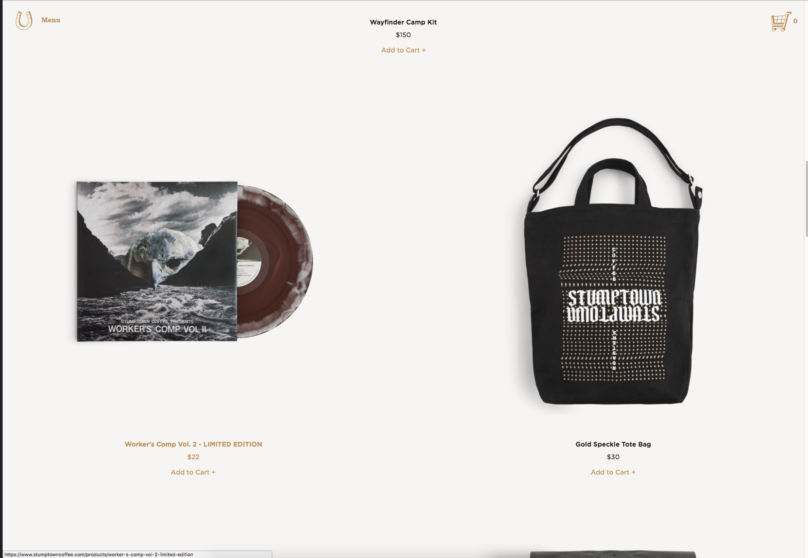

# Stumptown Mock-Up

#### A mock-up site for Stumptown Coffee, 7 Sept 2018

#### By Eric Conner

## Description

A mock-up website for Stumptown Coffee Roasters made using CSS styling.

## Setup/Installation Requirements

* Download the files
* Launch the index.html with an internet browser
* Compare with Stumptown's very own landing page

Stumptown's site:

My mock-up site:

## Known Bugs

The links aren't functional and there are some styling kinks to work out. The flex-box for the vinyl item is wonky. The shop now button isn't stylized.

## Support and contact details

Feedback, questions? Drop a line here: theluvq@gmail.com

## Technologies Used

Developed with SASS, Atom, Chrome and OS X.

### License

Copyright (c) 2018 **Eric Conner/Epicodus**

This software is licensed under the MIT license.
